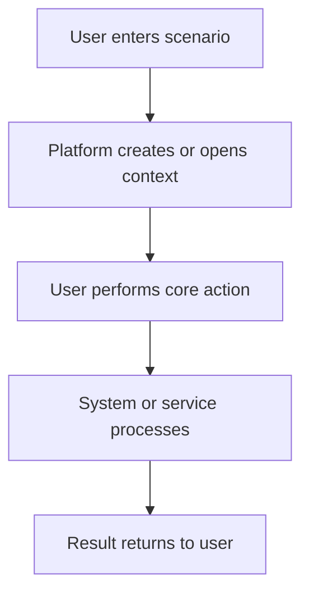

# Product MVP Analysis Markdown Template

Use this template for full PM analysis documents. Omit sections that do not apply.

## 1. Analysis Goal

- Target product or scenario:
- Target users:
- Business objective:
- Output audience:
- Key assumptions:

## 2. Scenario Flow

Describe the real user and system flow in numbered steps.

Use Mermaid only when the flow has multiple actors, branching, handoff, or long-running states.

## 3. MVP Minimum Loop

State the minimum real runnable loop in 5-10 steps. The loop should be complete enough to operate with real users, credentials, services, and persistence where the product requires them.

| Step | Page/System Action | Minimum Dependency | MVP Required | Notes |
| --- | --- | :---: | :---: | --- |
| Enter scenario | User clicks entry | L1/L2/L3 | Yes | Explain why this is required. |

## 4. Capability Breakdown

Default grading:

- **L1**: existing platform capability can be reused directly.
- **L2**: platform should add or extend reusable capability.
- **L3**: customer/business/content/model/third-party side owns it.

### L1 Existing Platform Capabilities

| Capability | Detailed Behavior | MVP Required |
| --- | --- | :---: |
|  |  | Yes/No |

### L2 Platform Additions or Extensions

| Capability | Detailed Behavior | MVP Required |
| --- | --- | :---: |
|  |  | Yes/No |

### L3 Customer or External Capabilities

| Capability | Detailed Behavior | MVP Required |
| --- | --- | :---: |
|  |  | Yes/No |

## 5. Cross-Scenario Common Capabilities

Use this section only when comparing multiple scenarios.

| Common Capability | Scenario A | Scenario B | Suggested Owner | MVP Required | Notes |
| --- | :---: | :---: | :---: | :---: | --- |
|  | Yes/No | Yes/No | L1/L2/L3 | Yes/No |  |

## 6. Statistics Summary

| Scenario | Grade | MVP=Yes | MVP=No | Total |
| --- | --- | :---: | :---: | :---: |
|  | L1 |  |  |  |

## 7. Review Conclusion

- Is the MVP loop complete?
- Which capabilities are true blockers?
- Which capabilities are useful but not MVP?
- Which items should be removed because they are outside the scenario?
